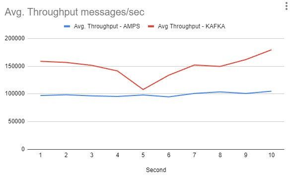

# AMPS VS KAFKA
comparison of performance between AMPS and KAFKA

Both server running on wsl (ubuntu 22)

Results below

**Latency:**

**Throughput**:

**Conclusion:**
1. In latency AMPS performs better.
2. In throughput KAFKA performs better.

Note: AMPS server is the evaluation version provided by 60east.

Details on Install/Run amps and kafka service is in src/resource/notes.txt